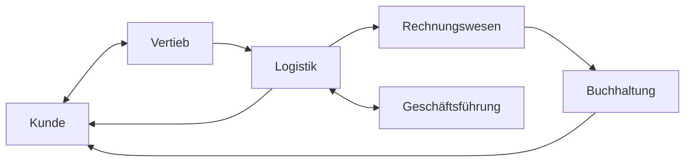
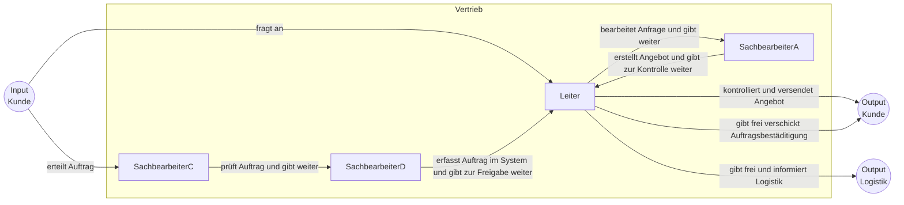
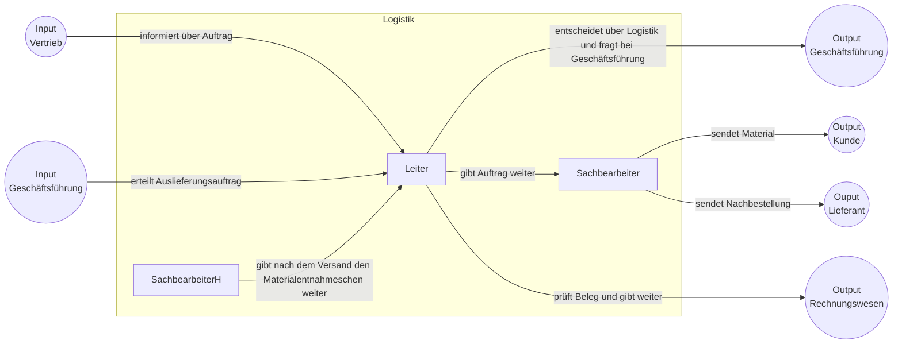
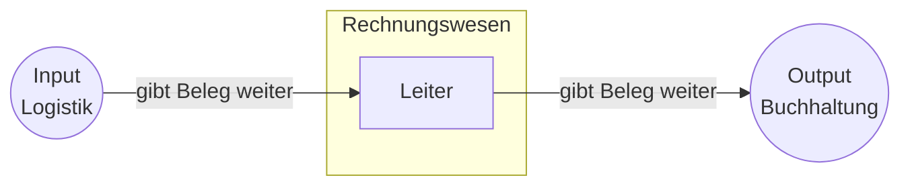
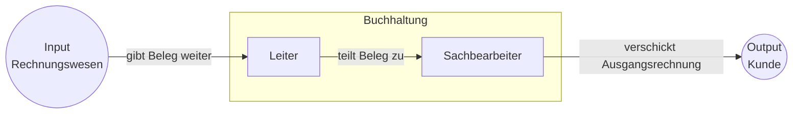
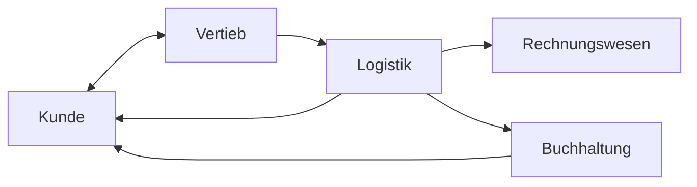
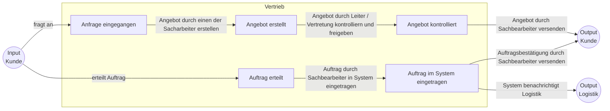
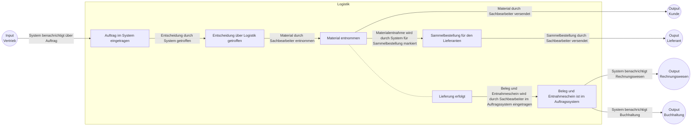
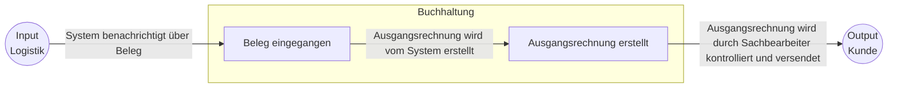

# Übung 1

## Autoren

Patrick Fischlhammer, Elias Leonhardsberger

## Fragen

### Was ist Anstoß bzw. Auslöser des Prozesses?

Anfrage des Kunden

### Womit endet der Prozess?

Rechnung an den Kunden

### Wer ist/sind Kunde(n)?

Anfragensteller

### Worin liegt der Nutzen des Prozesses für den Kunden?

Erhalten der Ware für Zahlung

### Woran kann man messen, wie gut dieser Prozess ist?

Durchlaufzeit, beteiligte Personen, Downtime mitten im Prozess(Kaffeezeit)

### Aus welchen Tätigkeiten besteht der Prozess?

1. Anfrage bearbeiten
1. Angebot erstellen
1. Kontrolle des Angebots
1. Freigabe des Angebots
1. Im Auftragverwaltungssystem erfassen
1. Freigabe des Auftrags
1. Auftragsbestädtigung verschicken
1. Logistik Entscheidung(Auf Lager, nachbestellen oder produzieren)
1. Bei Geschäftsführung nachfragen
1. Materialauftrag erstellen
1. Material und Auftrag weitergeben
1. Material ausliefern
1. Material nachbestellen
1. Materialentnahmeschein übermitteln
1. Beleg prüfen
1. Beleg an Rechnungswesen weiterleiten
1. Beleg an Buchhaltung weiterleiten
1. Beleg an Sachbearbeiter zuteilen
1. Ausgangsrechnung verschicken

### Was braucht man für diesen Prozess (Input)?

Anfrage, Material(Falls von Zulieferer)

### Was wird entlang dieses Prozesses an Output erzeugt?

Angebot, Lieferung, Nachbestellung, Ausgangsrechnung

## Ist Aufnahme

### Übersicht

### Vertrieb

### Logistik

### Rechnungswesen

### Buchhaltung

## Schwachstellenanalyse

- Leiter sind persönlich verantwortlich
- Keine Vertretung
- Daduch viele Liegezeiten
- Mehr Sachbearbeiter involviert als nötig
- Leiter der Logistik entscheidet nicht über Logistik
- Prozessschritte sind direkt an Personen gebunden
- Umleitung über Rechnungswesen um Rechnung zu erstellen
- Keine gesammelten Bestellungen beim Lieferanten

## Sollkonzeption

### Übersicht

### Vertrieb

### Logistik

### Buchhaltung

