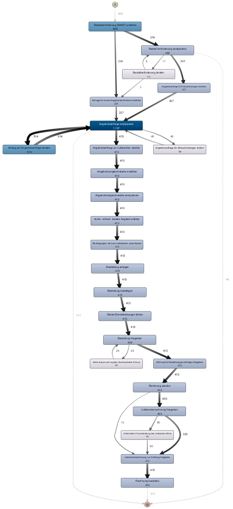
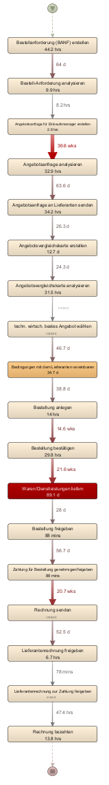
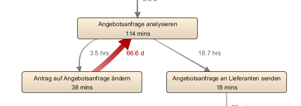
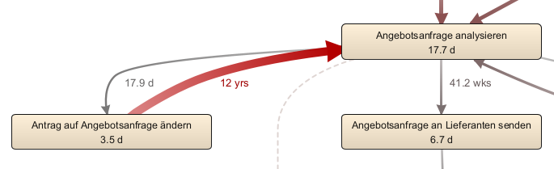
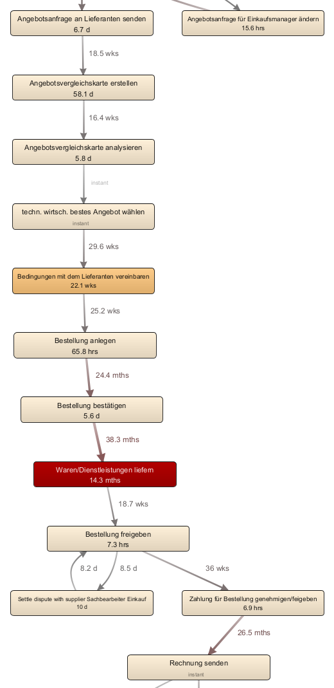
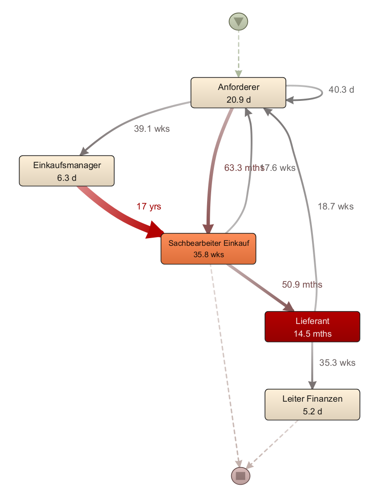

# Übung 4

Elias Leonhardsberger - S2310307019

## Import

## Analysefragen

### a) Wie viele Einkaufsfälle beinhaltet das Datenfile und stehen daher zur Analyse zur Verfügung?

608

### b) Welche Aktivität wird am häufigsten, welche am wenigsten oft ausgeführt?

häufigsten => Angebotsanfrage analysieren

wenigsten => Bestellanforderung ändern

### c) Bei wieviel verschiedenen Aktivitäten wird, laut Analyse, ein Durchlauf beendet? Geben Sie die Aktivitätsnamen an

3

- Angebotsanfrage analysieren
- Rechnung bezahlen
- Bestell-Anforderung analysieren

### d) Welche Person wird im gesamten Analysezeitraum am öftesten mit Aktivitäten beschäftigt? Geben Sie den Namen und die Anzahl an

Magdalena Predutta, 1089 Events

### e) Wie viele Fälle dauerten nicht länger als 75 Tage, welches als akzeptabel angesehen wird? Geben Sie die Anzahl (absolut) und die Prozent der Gesamtfälle an

517 => 85%

### f) Suchen Sie die am häufigsten auftretende Variante. Erstellen Sie einen Screenshot der Aktivitätsmappe. Wie viele Fälle wurden nach dieser Variante durchlaufen?

88 Cases

### g) Welche Variante hat die größte Durchlaufdauer? Geben Sie die Fall ID an. Welcher Prozessschritt (Prozessschritte) sind hier das Problem?

Case 655, Variante 14. Wartezeit zwischen Antrag auf Angebotsanfrage ändern und Angebotsanfrage analysieren.

### h) In wie vielen Fällen wurde die sechsthäufigste Variante durchlaufen? Wieviel Prozent der Gesamtfälle entspricht dies?

29 => 4,77%

### i) Bei welchem Aktivitätsschritt wurden die Fälle der fünfthäufigsten Variante immer beendet?

Angebotsanfrage analysieren

### j) Wieviel Prozent der Fälle liegt zwischen 18 und 90 Tagen Durchführungsdauer?

61 => 10%

### k) Wieviel Fälle wurden im Juni 2011 gestartet (absolut)? Wieviel Prozent der Gesamtfälle entspricht dies?

51 => 8%

## Schwachstellen

Wartezeit zwischen Antrag auf Angebotsanfrage ändern und Angebotsanfrage analysieren. Sachbearbeiter Einkauf sind überfordert.

Lange Wartezeiten beim Bestellen und Liefern. Die Aktivitätsdauer ist immer vergleichsweise kurz. Lieferanten sind überfordert.

## Verbesserungspotentiale

Sachbearbeiter Einkauf entlasten durch mehr Resourcen und mehr Aufteilung der Aufgaben. Angebotsanfrage analyse auslagern.

Lieferant Aktivitäten können schlechter aufgeteilt werden, daher mehr Resources allokieren.
